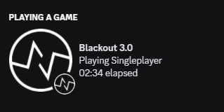

<h1 align="center">[Under Construction]</h1>

This mod is very early in development, come back later if you want to use it!

## block game utility mod

Not to be confused with the Meteor addon called BlackOut

- The name is inspired by Watch Dogs
- I made the first Blackout back in March 2020
- I was very sad after finding out someone else used the name but I'm not changing it now

 

Screenshots

GUI

Discord RPC

## Installation

[Click here](https://github.com/2qb/Blackout-3.0-Installer/releases/download/1.2/BlackoutInstaller.exe) to download the installer.

Manual installation

1. Install [Fabric](https://fabricmc.net/use/installer/) for Minecraft 1.19.4 (Fabric API is **not** required)
2. Download the latest release [here](https://github.com/chell-dev/Blackout-3.0/releases)
3. Put the downloaded .jar file in your `.minecraft/mods` folder

Recommended mods

- [MultiConnect](https://github.com/Earthcomputer/multiconnect/releases) to play on servers that use an older minecraft version
- [Sodium](https://www.curseforge.com/minecraft/mc-mods/sodium/download/4381988) to make the game playable
- [Mod Menu](https://www.curseforge.com/minecraft/mc-mods/modmenu/download/4159524) if you want the Mods button that's in forge

## Usage

- Open the GUI by pressing the `\` key
- Left / Right / Middle Click buttons to configure everything
- If you forget your GUI bind you can:
  - Change it in your config file (`.minecraft/Blackout/Config.txt`) under the line `Feature: GUI Bind`
  - If you have Mod Menu installed, open the GUI by pressing the config button

### Building

Click here

`git clone https://github.com/chell-dev/Blackout-3.0.git` or download the repository

After building, the output `.jar` will be in `build/libs/`

#### IntelliJ (recommended), Eclipse or VSCode

1. Import the project - see https://fabricmc.net/wiki/tutorial:setup, refer to the section for your IDE
2. Run the `build` gradle task

#### Windows
1. Open `cmd` in the project folder
2. Run `./gradlew.bat build`

#### Linux and Mac
1. `cd` to the project folder
2. Run `./gradlew build`

### Thank you

- [Fabric](https://fabricmc.net/)
- [Reflections](https://github.com/ronmamo/reflections)
- [KDiscordIPC](https://github.com/caoimhebyrne/KDiscordIPC)
- [hack.chat](https://hack.chat/)
- [DevLogin](https://github.com/PlanetTeamSpeakk/DevLogin)
- [Installer](https://github.com/2qb/Blackout-3.0-Installer)
